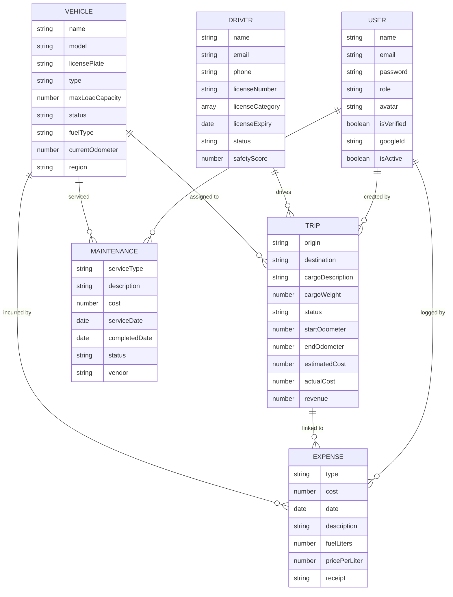

<p align="center">
  
</p>

<h1 align="center">🚛 FleetFlow</h1>
<h3 align="center">A Modular Fleet & Logistics Management System</h3>

<p align="center">
  
  
  
  
  
  
</p>

<p align="center">
  <a href="#-demo">🔗 Live Demo</a> •
  <a href="#-features">✨ Features</a> •
  <a href="#%EF%B8%8F-tech-stack">🛠️ Tech Stack</a> •
  <a href="#-getting-started">🚀 Getting Started</a> •
  <a href="#-api-reference">📡 API Reference</a> •
  <a href="#-project-structure">📂 Project Structure</a>
</p>

---

## 🔗 Demo

> 📌 **Add your live demo link here**
>
> `[ DEMO LINK GOES HERE ]`

---

## 📖 About

**FleetFlow** is a full-stack fleet and logistics management system built for organizations that need to track vehicles, drivers, trips, expenses, and maintenance — all from a single, elegant dashboard. It features **role-based access control (RBAC)** with four distinct user roles, **real-time analytics** with interactive charts, and **report generation** in PDF/CSV formats.

Whether you're a fleet manager overseeing hundreds of vehicles or a dispatcher coordinating daily routes, FleetFlow gives you the tools to make data-driven decisions.

---

## ✨ Features

### 🔐 Authentication & Authorization
- **Email/Password** registration with email verification
- **Google OAuth 2.0** single sign-on
- **JWT-based auth** with access & refresh token rotation
- **Role-Based Access Control (RBAC)** — 4 roles with granular permissions

### 🚗 Vehicle Management
- Add, edit, and retire vehicles (trucks, vans, bikes)
- Track odometer, fuel type, acquisition cost, and region
- Monitor real-time vehicle status: `available` • `on_trip` • `in_shop` • `retired`
- Cloudinary-powered image uploads

### 🧑‍✈️ Driver Management
- Full driver profiles with license info, categories, and expiry tracking
- Safety scores and trip completion rates (virtual computed fields)
- Driver statuses: `on_duty` • `off_duty` • `on_trip` • `suspended`
- Automatic license validity checks

### 🗺️ Trip Management
- Create and dispatch trips with origin/destination, cargo details, and vehicle-driver pairing
- Full trip lifecycle: `draft` → `dispatched` → `completed` / `cancelled`
- Odometer-based distance tracking and financial cost/revenue recording
- Linked to vehicles, drivers, and expenses

### 💰 Expense Tracking
- Log expenses by category: `fuel` • `maintenance` • `toll` • `insurance` • `other`
- Fuel-specific tracking (liters & price per liter)
- Receipt upload via Cloudinary
- Link expenses to specific vehicles and trips

### 🔧 Maintenance Management
- Schedule and track 10 types of services (oil change, brake service, engine repair, etc.)
- Service statuses: `in_progress` • `completed`
- Record vendor info, odometer at service, and costs
- Automatic vehicle status updates

### 📊 Analytics & Reporting
- **Dashboard KPIs**: fleet overview, driver stats, trip summary, maintenance alerts
- **Cost Breakdown**: pie chart of expense categories
- **Monthly Expenses**: line chart with year-over-year comparison
- **Trips per Vehicle**: bar chart ranking
- **Fuel Efficiency**: per-vehicle cost-per-km analysis
- **Vehicle ROI**: revenue vs. total cost calculation
- **Export Reports**: download data as **CSV** or **PDF**

### 🛡️ Security
- **Helmet** HTTP headers hardening
- **Rate limiting** (general + auth-specific)
- **CORS** configuration with credentials support
- **Input validation** using Joi schemas
- **Password hashing** with bcrypt (12 salt rounds)

---

## 🔑 Role-Based Access Control (RBAC)

FleetFlow implements a fine-grained permissions matrix across four user roles:

| Module         | 👔 Manager   | 📋 Dispatcher | 🦺 Safety Officer | 📈 Analyst  |
|----------------|-------------|---------------|-------------------|-------------|
| **Dashboard**  | Full Access | View Only     | View Only         | View Only   |
| **Vehicles**   | Full Access | View Only     | View Only         | No Access   |
| **Drivers**    | Full Access | View Only     | View / Edit       | No Access   |
| **Trips**      | Full Access | Full Access   | View Only         | View Only   |
| **Expenses**   | Full Access | View Only     | No Access         | View Only   |
| **Maintenance**| Full Access | View Only     | View Only         | View Only   |
| **Analytics**  | Full Access | View Only     | View Only         | Full Access |
| **Users**      | Full (RBAC) | No Access     | No Access         | No Access   |

---

## 🛠️ Tech Stack

### Frontend
| Technology | Purpose |
|---|---|
| **React 19** | UI library with hooks & functional components |
| **Vite 6** | Lightning-fast dev server & build tool |
| **Tailwind CSS 3** | Utility-first CSS framework |
| **React Router v7** | Client-side routing & protected routes |
| **Recharts** | Interactive data visualization charts |
| **Framer Motion** | Smooth animations & page transitions |
| **Lucide React** | Beautiful icon set |
| **Axios** | HTTP client with interceptor-based token refresh |
| **React Hot Toast** | Toast notification system |

### Backend
| Technology | Purpose |
|---|---|
| **Express 5** | Web framework with modern routing |
| **MongoDB + Mongoose 9** | NoSQL database with schema validation |
| **Passport.js** | Authentication middleware (Google OAuth strategy) |
| **JSON Web Tokens** | Stateless auth with access/refresh token pair |
| **BullMQ + Redis** | Background job queue for async email sending |
| **Cloudinary** | Cloud-based image & file storage |
| **Nodemailer** | SMTP-based email (verification, password reset) |
| **Joi** | Request payload validation |
| **PDFKit** | Server-side PDF report generation |
| **json2csv** | CSV export for analytics data |
| **Helmet** | Security headers middleware |
| **Morgan** | HTTP request logger |

### Infrastructure
| Technology | Purpose |
|---|---|
| **Docker Compose** | Redis container orchestration |
| **Redis** | Job queue backend (BullMQ) |

---

## 🚀 Getting Started

### Prerequisites

- **Node.js** v18+ and **npm**
- **MongoDB** (Atlas or local instance)
- **Redis** (via Docker or local install)
- **Cloudinary** account (for image uploads)
- *(Optional)* **Google Cloud Console** project for OAuth

### 1. Clone the Repository

```bash
git clone https://github.com/kaustav3071/FleetFlow-A-Modular-Fleet-Logistics-Management-System.git
cd FleetFlow-A-Modular-Fleet-Logistics-Management-System
```

### 2. Backend Setup

```bash
cd backend
npm install
```

Create a `.env` file in the `backend/` directory:

```env
# ===== Database =====
MONGO_URI=mongodb+srv://<username>:<password>@<cluster>.mongodb.net/FleetFlow

# ===== Server =====
PORT=5000
NODE_ENV=development

# ===== JWT Secrets =====
JWT_ACCESS_SECRET=your-access-secret
JWT_REFRESH_SECRET=your-refresh-secret
JWT_ACCESS_EXPIRY=15m
JWT_REFRESH_EXPIRY=7d

# ===== Google OAuth (Optional) =====
GOOGLE_CLIENT_ID=your-google-client-id
GOOGLE_CLIENT_SECRET=your-google-client-secret
GOOGLE_CALLBACK_URL=http://localhost:5000/api/v1/auth/google/callback

# ===== Redis =====
REDIS_URL=redis://localhost:6379

# ===== Cloudinary =====
CLOUDINARY_CLOUD_NAME=your-cloud-name
CLOUDINARY_API_KEY=your-api-key
CLOUDINARY_API_SECRET=your-api-secret

# ===== Nodemailer SMTP =====
SMTP_HOST=smtp.gmail.com
SMTP_PORT=587
SMTP_USER=your-email@gmail.com
SMTP_PASS=your-app-password
EMAIL_FROM="FleetFlow <noreply@fleetflow.com>"

# ===== Frontend URL =====
FRONTEND_URL=http://localhost:3000
```

Start Redis (via Docker):

```bash
docker compose up -d
```

Start the backend server:

```bash
npm run dev
```

The API will be running at `http://localhost:5000`.

### 3. Frontend Setup

```bash
cd frontend
npm install
npm run dev
```

The app will be running at `http://localhost:3000`.

---

## 📡 API Reference

All endpoints are prefixed with `/api/v1`.

### Authentication

| Method | Endpoint | Description |
|--------|----------|-------------|
| `POST` | `/auth/register` | Register a new user |
| `POST` | `/auth/login` | Login with email/password |
| `POST` | `/auth/logout` | Logout & invalidate tokens |
| `GET` | `/auth/me` | Get current user profile |
| `POST` | `/auth/refresh-token` | Refresh access token |
| `GET` | `/auth/verify-email/:token` | Verify email address |
| `GET` | `/auth/google` | Initiate Google OAuth flow |
| `GET` | `/auth/google/callback` | Google OAuth callback |

### Vehicles

| Method | Endpoint | Description |
|--------|----------|-------------|
| `GET` | `/vehicles` | List all vehicles (with filters) |
| `GET` | `/vehicles/:id` | Get vehicle details |
| `POST` | `/vehicles` | Create a new vehicle |
| `PUT` | `/vehicles/:id` | Update a vehicle |
| `DELETE` | `/vehicles/:id` | Delete a vehicle |

### Drivers

| Method | Endpoint | Description |
|--------|----------|-------------|
| `GET` | `/drivers` | List all drivers (with filters) |
| `GET` | `/drivers/:id` | Get driver details |
| `POST` | `/drivers` | Create a new driver |
| `PUT` | `/drivers/:id` | Update a driver |
| `DELETE` | `/drivers/:id` | Delete a driver |

### Trips

| Method | Endpoint | Description |
|--------|----------|-------------|
| `GET` | `/trips` | List all trips (with filters) |
| `GET` | `/trips/:id` | Get trip details |
| `POST` | `/trips` | Create a new trip |
| `PUT` | `/trips/:id` | Update a trip |
| `PATCH` | `/trips/:id/dispatch` | Dispatch a trip |
| `PATCH` | `/trips/:id/complete` | Complete a trip |
| `DELETE` | `/trips/:id` | Delete a trip |

### Maintenance

| Method | Endpoint | Description |
|--------|----------|-------------|
| `GET` | `/maintenance` | List maintenance records |
| `GET` | `/maintenance/:id` | Get maintenance details |
| `POST` | `/maintenance` | Create maintenance record |
| `PUT` | `/maintenance/:id` | Update maintenance record |
| `DELETE` | `/maintenance/:id` | Delete maintenance record |

### Expenses

| Method | Endpoint | Description |
|--------|----------|-------------|
| `GET` | `/expenses` | List all expenses (with filters) |
| `GET` | `/expenses/:id` | Get expense details |
| `POST` | `/expenses` | Create an expense |
| `PUT` | `/expenses/:id` | Update an expense |
| `DELETE` | `/expenses/:id` | Delete an expense |

### Analytics

| Method | Endpoint | Description |
|--------|----------|-------------|
| `GET` | `/analytics/dashboard` | Dashboard KPIs (fleet, drivers, trips) |
| `GET` | `/analytics/cost-breakdown` | Expense category breakdown |
| `GET` | `/analytics/trips-per-vehicle` | Trip count per vehicle |
| `GET` | `/analytics/monthly-expenses` | Monthly expense trends |
| `GET` | `/analytics/fuel-efficiency` | Fuel cost per km per vehicle |
| `GET` | `/analytics/vehicle-roi` | Vehicle ROI analysis |
| `GET` | `/analytics/export` | Export report as CSV or PDF |

---

## 📂 Project Structure

```
FleetFlow/
├── backend/
│   ├── config/
│   │   ├── cloudinary.js         # Cloudinary SDK configuration
│   │   ├── emailQueue.js         # BullMQ email job queue
│   │   ├── passport.js           # Google OAuth strategy
│   │   └── redis.js              # Redis (IORedis) connection
│   ├── controllers/
│   │   ├── analytics.controller.js
│   │   ├── auth.controller.js
│   │   ├── driver.controller.js
│   │   ├── expense.controller.js
│   │   ├── maintenance.controller.js
│   │   ├── trip.controller.js
│   │   └── vehicle.controller.js
│   ├── db/
│   │   └── db.js                 # MongoDB connection
│   ├── middlewares/
│   │   ├── auth.middleware.js     # JWT verification & role guard
│   │   ├── error.middleware.js    # Global error handler
│   │   ├── upload.middleware.js   # Multer + Cloudinary upload
│   │   └── validate.middleware.js # Joi schema validation
│   ├── models/
│   │   ├── User.model.js
│   │   ├── Vehicle.model.js
│   │   ├── Driver.model.js
│   │   ├── Trip.model.js
│   │   ├── Expense.model.js
│   │   └── Maintenance.model.js
│   ├── routes/
│   │   ├── index.js              # Route aggregator
│   │   ├── auth.routes.js
│   │   ├── vehicle.routes.js
│   │   ├── driver.routes.js
│   │   ├── trip.routes.js
│   │   ├── maintenance.routes.js
│   │   ├── expense.routes.js
│   │   └── analytics.routes.js
│   ├── utils/
│   │   ├── ApiError.js           # Custom error class
│   │   ├── ApiResponse.js        # Standardized response
│   │   ├── asyncHandler.js       # Async try-catch wrapper
│   │   ├── emailTemplates.js     # HTML email templates
│   │   └── generateTokens.js     # JWT access/refresh tokens
│   ├── validators/
│   │   ├── auth.validator.js
│   │   ├── driver.validator.js
│   │   ├── expense.validator.js
│   │   ├── maintenance.validator.js
│   │   ├── trip.validator.js
│   │   └── vehicle.validator.js
│   ├── server.js                 # App entry point
│   ├── docker-compose.yml        # Redis container
│   └── package.json
│
├── frontend/
│   ├── src/
│   │   ├── api/
│   │   │   ├── axios.js          # Axios instance with interceptors
│   │   │   ├── auth.js
│   │   │   ├── vehicles.js
│   │   │   ├── drivers.js
│   │   │   ├── trips.js
│   │   │   ├── expenses.js
│   │   │   ├── maintenance.js
│   │   │   └── analytics.js
│   │   ├── components/
│   │   │   ├── charts/           # Recharts visualizations
│   │   │   ├── layout/           # DashboardLayout, Sidebar, Navbar
│   │   │   └── ui/               # Reusable UI components
│   │   ├── context/
│   │   │   └── AuthContext.jsx   # Global auth state (React Context)
│   │   ├── hooks/
│   │   │   ├── useDebounce.js
│   │   │   ├── useFetch.js
│   │   │   └── usePermissions.js
│   │   ├── pages/
│   │   │   ├── AuthPage.jsx
│   │   │   ├── VerifyEmailPage.jsx
│   │   │   ├── Dashboard/
│   │   │   ├── Vehicles/
│   │   │   ├── Drivers/
│   │   │   ├── Trips/
│   │   │   ├── Expenses/
│   │   │   ├── Maintenance/
│   │   │   └── Analytics/
│   │   ├── utils/
│   │   │   ├── constants.js
│   │   │   ├── formatters.js
│   │   │   └── permissions.js    # RBAC permissions matrix
│   │   ├── App.jsx
│   │   ├── main.jsx
│   │   └── index.css
│   ├── index.html
│   ├── tailwind.config.js
│   ├── postcss.config.js
│   ├── vite.config.js
│   └── package.json
│
└── README.md
```

---

## 🗃️ Database Schema



---

## 🧪 Environment Variables

| Variable | Required | Description |
|---|---|---|
| `MONGO_URI` | ✅ | MongoDB connection string |
| `PORT` | ❌ | Server port (default: `5000`) |
| `NODE_ENV` | ❌ | `development` or `production` |
| `JWT_ACCESS_SECRET` | ✅ | Secret key for access tokens |
| `JWT_REFRESH_SECRET` | ✅ | Secret key for refresh tokens |
| `JWT_ACCESS_EXPIRY` | ❌ | Access token TTL (default: `15m`) |
| `JWT_REFRESH_EXPIRY` | ❌ | Refresh token TTL (default: `7d`) |
| `GOOGLE_CLIENT_ID` | ❌ | Google OAuth client ID |
| `GOOGLE_CLIENT_SECRET` | ❌ | Google OAuth client secret |
| `GOOGLE_CALLBACK_URL` | ❌ | Google OAuth callback URL |
| `REDIS_URL` | ✅ | Redis connection string |
| `CLOUDINARY_CLOUD_NAME` | ✅ | Cloudinary cloud name |
| `CLOUDINARY_API_KEY` | ✅ | Cloudinary API key |
| `CLOUDINARY_API_SECRET` | ✅ | Cloudinary API secret |
| `SMTP_HOST` | ✅ | SMTP server host |
| `SMTP_PORT` | ✅ | SMTP server port |
| `SMTP_USER` | ✅ | SMTP username |
| `SMTP_PASS` | ✅ | SMTP password/app password |
| `EMAIL_FROM` | ❌ | Sender email address |
| `FRONTEND_URL` | ❌ | Frontend URL for email links |

---

## 🤝 Contributing

Contributions are welcome! Please follow these steps:

1. **Fork** the repository
2. **Create** a feature branch: `git checkout -b feature/amazing-feature`
3. **Commit** your changes: `git commit -m 'Add amazing feature'`
4. **Push** to the branch: `git push origin feature/amazing-feature`
5. **Open** a Pull Request

---

## 📄 License

This project is licensed under the **ISC License**.

---

## 👤 Author

**Kaustav Das**

---

<p align="center">
  Made with ❤️ for modern fleet management
</p>
